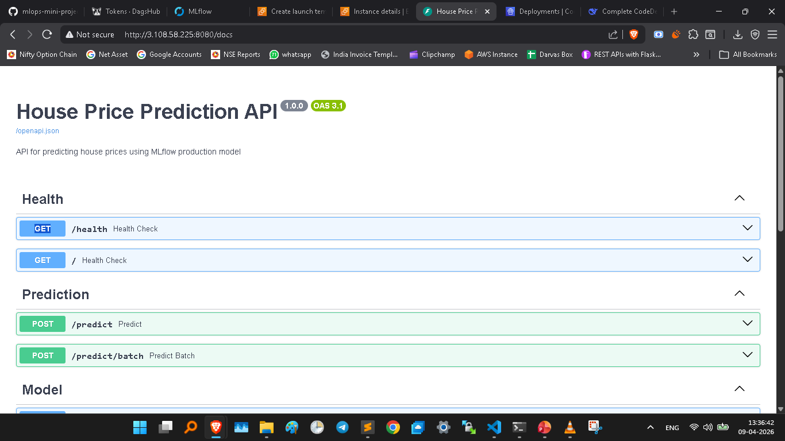

## Project Setup

- Create a project folder 
- git init
- dvc init
- requirements.txt
- Create venv and install requirements: pip install -r requirements.txt
- Create github repo and add remote: git remote add origin <.git url>
- Run template.py to create folder and files
- Create setup.py and pip install -e .
- Setup s3 buket & aws ecr for docker app
    - create iam user
    - attach policies
    - setup aws: pip install awscli && aws configure (access key and security key)

- dvc remote add -d myremote s3://my-mlops-project-demo/house_price_prediction
- dvc config core.autostage true ---> auto pull everytime    
- Setup dagshub and host mlflow
- Perform experiments assesment, cleaning, EDA, transformation ---> EDA round2 ---> transformation, model building & hyperparameters (track with mlflow) in 4 phases: basic, features, algorithm, hyperparameter tuning
- Convert best overall into dvc pipeline: create components like data_ingestion, data_transformation, model_trainer, model_evalutaion, logger etc
- Upload best model on dagshub hosted mlflow model_registry in staging
- Perform model test & if success then push model to production
- Create fastapi (fetch latest model in production from mlflow model_registry and make predictions)

## CICD

- Create CI/CD pipeline using github actions and docker
    - **CI (continuous integration)** is a software development practice where developers regularly update the code with new changes and merge thier code changes into github or any other shared centralized repository usually multiple times a day. each merge triggers automation build and testing to detect and fix any issues. This helps to ensure that software remains in deployable stage everytime. 

    - STEPS:
        + Create a folder .github/workflows/ci.yaml
            - name, on, jobs (name, runs on, steps)

        + Add github secrets:
            - AWS_ACCESS_KEY_ID
            - AWS_SECRET_ACCESS_KEY
            - AWS_REGION
            - S3_BUCKET_NAME
            - DAGSHUB_PAT

        + **This step will take a lot of your time.. lol**
        
        + Test fast api in CI

        + **Docker packages your ML code, libraries, and system settings into a portable container so it runs the same way on any machine—ending "it works on my laptop" problems forever.**
            - Isolated (work in isolated environment)
            - Scalability (copy paste docker images to scale)
            
            - **Docker Engine**
                - Docker deamon: Its a backend service running on host machine
                - Docker CLI: user interacts with docker deamon using CLI
                - Rest API: communication b/w docker deamon and cli happens through restapi
            
            - **Docker images**
                - Its a stand-alone lightweight and executable software that includes everything needed to run a software like runtime, libraries, environmental variables, config files etc

            - **Docker Container**
                - Its a running instance of docker image 
                - When we run the docker image, then it creates instance of docker image which is called docker container

            **Docker File**
                - Its a text file which contians instructions of how to build docker image
                - Each instruction creates a layer in the image
                - Dockerfile is used to automate the image creation process

            **Docker Registry**
                - where we can save our docker image same as in github we save our code repo, in docker registry we store our docker images
                - like Dockerhub, AWS ECR etc

        + Dockerize fastapi app
            - Start docker desktop
            - Create Dockerfile (dockerize only fastapi not whole project)
            - `docker build -t house-price-api:latest .` to build new image from dockerfile
            - `docker system prune -a --volumes -f` to delete everything
            - `docker run -d -p 8080:8000 -e DAGSHUB_PAT="your_dagshub_token" house-price-api` to run the app
            - `docker ps` or `docker ps -a` to check running images
            - `docker logs <container id>` to check logs if any error
            - `check http://localhost:8080/docs` and test with below sample values

                {
                    "area_sqft": 650,
                    "bedroom_num": 1,
                    "bathroom_num": 1,
                    "balcony_num": 1,
                    "property_type": "flat",
                    "facing": "East",
                    "agePossession": "5-10 years",
                    "floor_number": 2,
                    "total_floors": 5,
                    "feature_count": 2,
                    "furnish_count": 1,
                    "safety_rating": 3.5,
                    "lifestyle_rating": 3.0,
                    "green_area_rating": 2.5,
                    "amenities_rating": 3.0,
                    "rate_per_sqft": 4000
                    }

                {
                    "area_sqft": 3500,
                    "bedroom_num": 5,
                    "bathroom_num": 4,
                    "balcony_num": 3,
                    "property_type": "house",
                    "facing": "South",
                    "agePossession": "1-3 years",
                    "floor_number": 2,
                    "total_floors": 2,
                    "feature_count": 10,
                    "furnish_count": 8,
                    "safety_rating": 4.8,
                    "lifestyle_rating": 4.9,
                    "green_area_rating": 4.7,
                    "amenities_rating": 4.8,
                    "rate_per_sqft": 8000
                    }

                {
                    "area_sqft": 2100,
                    "bedroom_num": 4,
                    "bathroom_num": 3,
                    "balcony_num": 3,
                    "property_type": "flat",
                    "facing": "North",
                    "agePossession": "0-1 years",
                    "floor_number": 15,
                    "total_floors": 20,
                    "feature_count": 8,
                    "furnish_count": 6,
                    "safety_rating": 5.0,
                    "lifestyle_rating": 5.0,
                    "green_area_rating": 4.5,
                    "amenities_rating": 5.0,
                    "rate_per_sqft": 7000
                    }

                {
                    "area_sqft": 1800,
                    "bedroom_num": 3,
                    "bathroom_num": 2,
                    "balcony_num": 1,
                    "property_type": "house",
                    "facing": "West",
                    "agePossession": "10+ years",
                    "floor_number": 1,
                    "total_floors": 1,
                    "feature_count": 3,
                    "furnish_count": 2,
                    "safety_rating": 2.5,
                    "lifestyle_rating": 2.0,
                    "green_area_rating": 2.0,
                    "amenities_rating": 2.5,
                    "rate_per_sqft": 3500
                    }
        + Push docker image to AWS ECR (use "view push commands")
        + **Deployment startegy #1 --> EC2**
            - `RUN this docker image on EC2`
            - setup EC2
            - connect to terminal from aws
            - run below commands:
                1. sudo apt-get update
                2. sudo apt-get install -y docker.io
                3. sudo systemctl start docker
                4. sudo systemctl enable docker
                5. sudo apt-get update
                6. sudo apt-get install -y unzip curl
                7. curl "https://awscli.amazonaws.com/awscli-exe-linux_x86_64.zip" -o "awscliv2.zip"
                8. unzip awscliv2.zip
                9. sudo ./aws/install
                10. sudo usermod -aG docker ubuntu
                11. aws configure
                12. run aws push commands: 
                    + aws ecr get-login-password --region ap-south-1 | docker login --username AWS --password-stdin 739275446561.dkr.ecr.ap-south-1.amazonaws.com
                    + docker pull 739275446561.dkr.ecr.ap-south-1.amazonaws.com/house-price-api:latest
                    + docker run -d -p 8080:8000 -e DAGSHUB_PAT="your_actual_token_here" --name house-price-api 739275446561.dkr.ecr.ap-south-1.amazonaws.com/prashant-ecr:latest
                    + Add security rules: add http traffic

        + Add above docker image build, push to ECR & deployment on EC2 in CI workflow
            - Create EC2 machine and run below commands:
                - sudo apt-get update
                - sudo apt-get install -y docker.io
                - sudo systemctl start docker
                - sudo systemctl enable docker
                - sudo apt-get update
                - sudo apt-get install -y unzip curl
                - curl "https://awscli.amazonaws.com/awscli-exe-linux_x86_64.zip" -o "awscliv2.zip"
                - unzip awscliv2.zip
                - sudo ./aws/install
                - sudo usermod -aG docker ubuntu- 
                - exit

            - add github secrets to deploy ec2
            - open new terminal and check `docker --version`
            - update CI with `deploy to ec2` steps
            - commit & push 
            - add security group

        + **Additional Tips**
            - reduce the size of the docker image using `multi-stage` build to reduce the cost
            - reduce the size of the docker image using `multi-layers` basically write compact dockerfile
            - install python libraries with no-cache-dir to avoid caching unneccasry files
            - remove unneccasry files after build in dockerfile

        + **Problem with EC2 deployment (single server and single container deployment)**
            - Scalability: we can do 2 type of scaling:
                1. vertical scaling: upgrade hardware (increasing ram, hdd etc)
                2. horizontal scaling: additional servers to distribute load --> Most Preffered in ML
                
            - We can spin-up 2 ec2 servers manually but it will be impossible in case of scaling like spinning 100s of servers
            
            - Traffic Routing: lets say we have 100s of servers running, who will decide when to route      traffic and where?

            - Rigid setup: Doesn't care about the traffic, server count remains same. we have to manually stop and start the server

            - Manual Update in all servers incase we have to update with new docker image

            - Potential downtime when updating manaully

            - No health check whether servers are active or died

            - No centralized logging and monitoring -- we'll have to go to each aws control panel

            - Security management manually independentally

            - Lack of mechanism to figure out which server died & spinup new server against that

            - Complexity in CI/CD pipeline

        
            + **Solution**
                - `Manual Server starting`: Spinup new server quickly using pre-defined templates : `AWS AMIs`
                - `Traffic routing`: use `load balancer` to route traffic
                - `Rigid Setup`: Use ASG service (auto scaling group) which will auto spin or stop new servers as and when required based on threshold we have setup, It will also avoid `potential downtime issue, health checks, monitoring, security management`
            
            + **Remaining Issues**
            + when we have a new docker image, how we can update and deploy that to all servers
            + what startegy we can use to deploy
            + how can we can rollback to previous working version if something goes wrong
            + how we can integrate LB, ASG etc into CI/CD

            + **Solution**
                - code changes
                - build docker images
                - push to ecr

                - `All above can be handled by CI as of now`
                - Manual task
                - Edit launch template
                - Use latest template in ASG which will have recent changes
                - Similarly we can roll back -- just change the template
                - **Although, Downtime is still there since we are manually stopiing servers**

            + **Deployment startegy #2 --> ECS**
                - We can use **AWS CodeDeploy**:
                    1. Readymade Deployment startegy: BlueGreen or Rolling
                    2. Automated rollbacks
                    3. More control over Deployment
                    4. Smooth integration with CICD

                - **Steps**
                    0. create 2 IAM user roles
                    1. install codedeploy runner on EC2 machines
                    2. create new launch template (userdata.txt)
                    3. create new ASG
                    4. deploy ECR docker image on ASG using CodeDeploy service
                        - we create a application in CodeDeploy service
                        - we create a deployment group in this application
                        - connect this deployment group with ASG
                    5. create new deployment which will have instructions of what to do at the time of deployment like docker istall, awscli install, pull image from ecr, run etc
                    6. All these instructions will be under appspec.yaml
                    7. Run this deployment which will automatiaclly execute instructions on ASG servers
                    8. If stuck at allow traffic : It must be bcoz target group set to port 80 whereas it should be at port 8080
                    9. Target group PORT = Docker run's HOST PORT
                    10. Check : http://3.108.58.225:8080/docs & http://my-elb-1730727805.ap-south-1.elb.amazonaws.com/docs - both should work -- means load balancer is working perfectly !!
                    11. check aws_deployed_app_screenshot.pdf

                    

                    

- Model retraining CT pipeline using airflow (manual, scheduled, event driven like new data/model_performance_drift etc) using evidently ai

git add . && git commit -m "fastapi app test added with fastapi server in background" && git push origin main